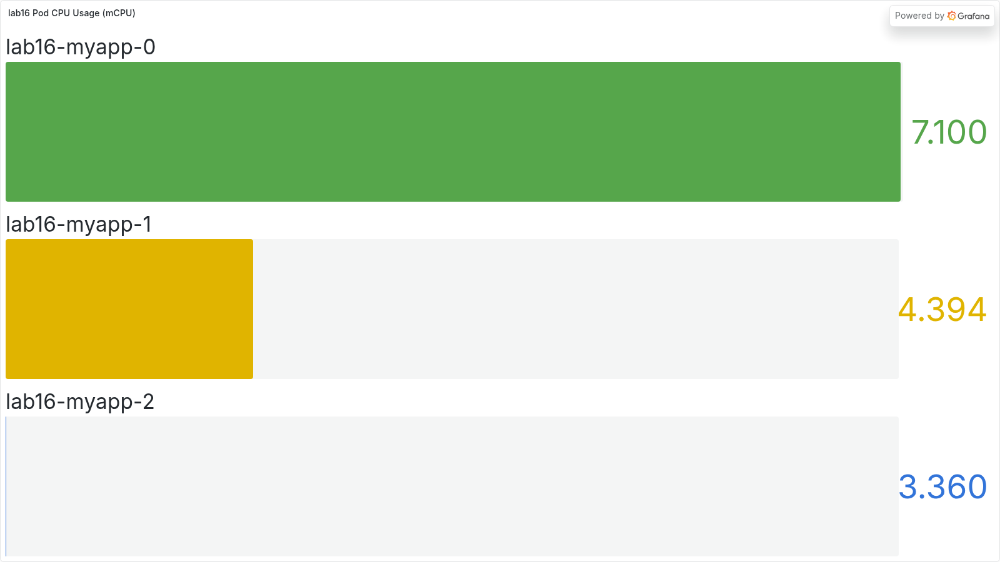
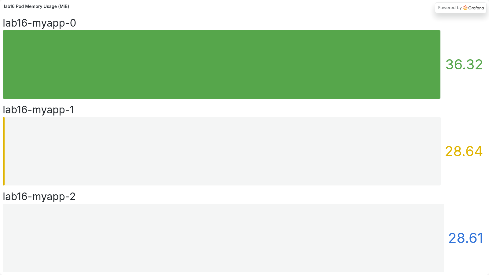
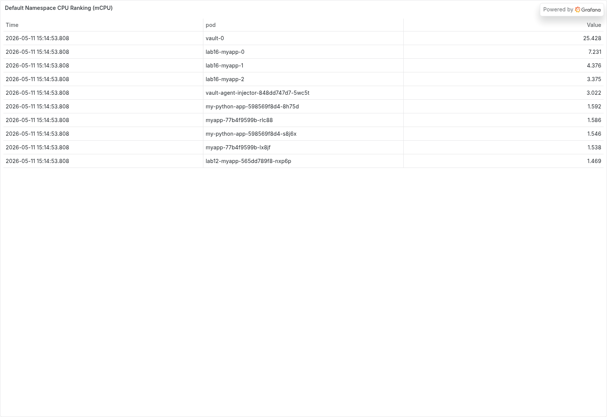
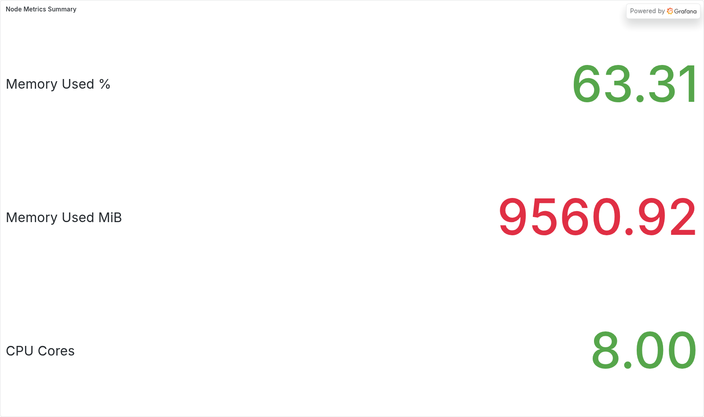
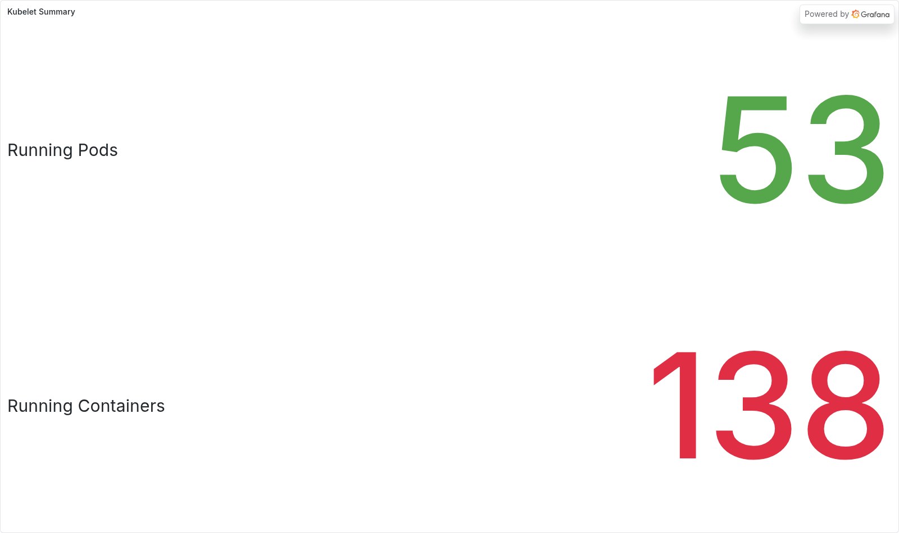
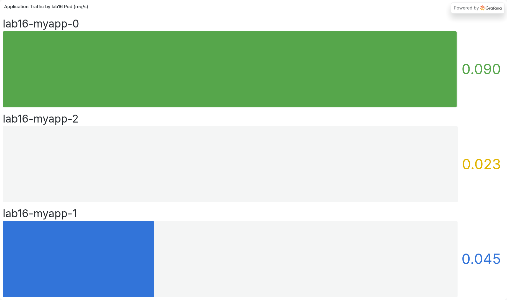
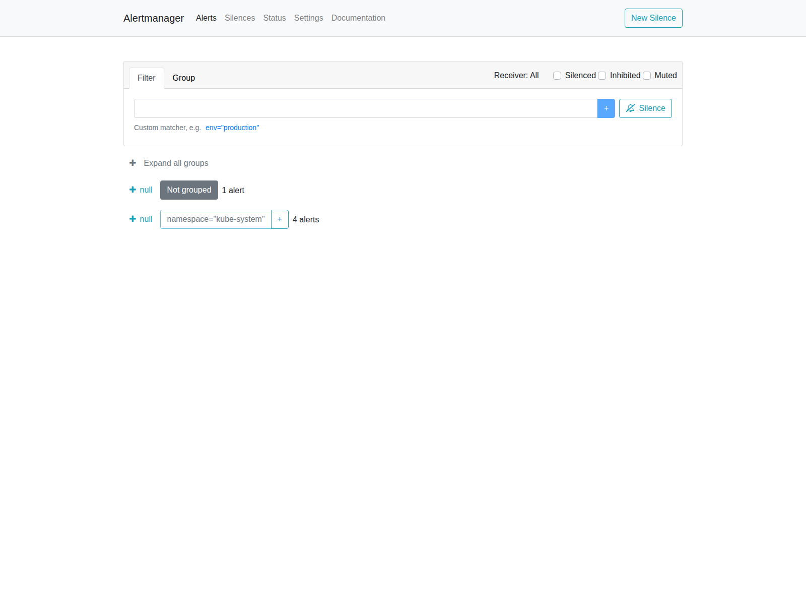

# Lab 16 Report - Kubernetes Monitoring and Init Containers

## Overview

For this lab I used the `kube-prometheus-stack` Helm chart in the `monitoring` namespace and deployed my application as a StatefulSet in the `default` namespace with two init containers:

1. `init-download` downloads a file into a shared `emptyDir` volume.
2. `wait-for-service` waits until `kubernetes.default.svc.cluster.local` resolves before the app starts.

I also completed the bonus implementation by exposing `/metrics` from the Flask app and adding a `ServiceMonitor` so Prometheus can scrape the application automatically.

## Task 1 - Stack Components

These are the roles of the main monitoring components in my own words:

| Component | Role |
|---|---|
| Prometheus Operator | Watches Kubernetes custom resources such as `Prometheus`, `Alertmanager`, `ServiceMonitor`, and keeps the monitoring stack configured correctly. |
| Prometheus | Scrapes metrics from Kubernetes components and workloads, stores time series data, and answers PromQL queries. |
| Alertmanager | Receives firing alerts from Prometheus and groups or routes them for alert handling. |
| Grafana | Reads metrics from Prometheus and shows them in dashboards. |
| kube-state-metrics | Exposes Kubernetes object state such as pods, StatefulSets, namespaces, and PVCs as Prometheus metrics. |
| node-exporter | Exposes host-level metrics from the Kubernetes node such as CPU, memory, filesystem, and network counters. |

## Helm Installation

Commands used:

```bash
helm repo add prometheus-community https://prometheus-community.github.io/helm-charts
helm repo update

helm upgrade --install monitoring prometheus-community/kube-prometheus-stack \
  --namespace monitoring \
  --create-namespace \
  --wait \
  --timeout 15m
```

The release was already present in my cluster from an earlier attempt and had status `failed`, so I repaired it with `helm upgrade --install` until the status became `deployed`.

## Installation Evidence

Command:

```bash
kubectl get po,svc -n monitoring
```

Output:

```text
NAME                                                         READY   STATUS    RESTARTS   AGE
pod/alertmanager-monitoring-kube-prometheus-alertmanager-0   2/2     Running   0          18m
pod/monitoring-grafana-78966c89c7-crbqs                      3/3     Running   0          19m
pod/monitoring-kube-prometheus-operator-6b4c47dd76-xmkdb     1/1     Running   0          19m
pod/monitoring-kube-state-metrics-67d5f7bf68-8wd7m           1/1     Running   0          19m
pod/monitoring-prometheus-node-exporter-2vgkq                1/1     Running   0          19m
pod/prometheus-monitoring-kube-prometheus-prometheus-0       2/2     Running   0          17m

NAME                                              TYPE        CLUSTER-IP      EXTERNAL-IP   PORT(S)                      AGE
service/alertmanager-operated                     ClusterIP   None            <none>        9093/TCP,9094/TCP,9094/UDP   3d4h
service/monitoring-grafana                        ClusterIP   10.107.50.123   <none>        80/TCP                       3d4h
service/monitoring-kube-prometheus-alertmanager   ClusterIP   10.99.31.214    <none>        9093/TCP,8080/TCP            3d4h
service/monitoring-kube-prometheus-operator       ClusterIP   10.98.252.157   <none>        443/TCP                      3d4h
service/monitoring-kube-prometheus-prometheus     ClusterIP   10.96.27.242    <none>        9090/TCP,8080/TCP            3d4h
service/monitoring-kube-state-metrics             ClusterIP   10.107.50.253   <none>        8080/TCP                     3d4h
service/monitoring-prometheus-node-exporter       ClusterIP   10.96.69.25     <none>        9100/TCP                     3d4h
service/prometheus-operated                       ClusterIP   None            <none>        9090/TCP                     3d4h
```

## Task 2 - Grafana Dashboard Answers

I generated some requests against the three `lab16-myapp-*` pods before checking Grafana so the pod metrics would be easier to compare.

The default kube-prometheus dashboards were not reliable as screenshot evidence in this cluster because several of them expected a `cluster` label that is not present on the scraped series here. To make the report usable, I created a small Grafana dashboard with equivalent PromQL panels and captured the screenshots below from that dashboard.

### 1. Pod resources of the StatefulSet

Current values from Prometheus for `lab16-myapp`:

| Pod | CPU | Memory |
|---|---|---|
| `lab16-myapp-0` | `7.100 mCPU` | `36.32 MiB` |
| `lab16-myapp-1` | `4.394 mCPU` | `28.64 MiB` |
| `lab16-myapp-2` | `3.360 mCPU` | `28.61 MiB` |

Screenshots:





### 2. Which pods use most and least CPU in `default`

At the moment I captured the dashboard data:

1. Most CPU: `vault-0` at `25.43 mCPU`
2. Least CPU: `myapp-77b4f9599b-lx8jf` at `1.46 mCPU`

Screenshot:



### 3. Node metrics

For the Minikube node:

1. Memory used: `63.31%`
2. Memory used: `9560.92 MiB`
3. CPU cores: `8`

Screenshot:



### 4. Kubelet managed pods and containers

The kubelet reported:

1. Running pods: `53`
2. Running containers: `138`

Screenshot:



### 5. Network traffic for pods in `default`

The default kube-prometheus networking dashboard was still empty in this Minikube and Kubernetes 1.35 environment, because pod-level receive and transmit byte metrics were not exposed for `default`.

What I verified:

1. Prometheus did not expose `container_network_*` pod metrics in this cluster.
2. Because of that, the built-in pod networking panels stayed empty.
3. For the screenshot evidence below I used a custom Grafana panel based on `http_requests_total` to show real application traffic per `lab16` pod.

Traffic values shown in the panel:

1. `lab16-myapp-0`: `0.090 req/s`
2. `lab16-myapp-1`: `0.045 req/s`
3. `lab16-myapp-2`: `0.023 req/s`

Supporting check:

```bash
curl -s http://127.0.0.1:9090/api/v1/label/__name__/values | jq '[.data[] | select(test("container_network_"))]'
```

Result:

```json
[]
```

Screenshot:



### 6. Active alerts in Alertmanager

At capture time the Alertmanager API returned `7` active alerts. The screenshot shows them grouped in the UI.

1. `KubeStatefulSetUpdateNotRolledOut`
2. `TargetDown`
3. `Watchdog`
4. `etcdInsufficientMembers`
5. `etcdMembersDown`

Screenshot:



## Task 3 - Init Containers

I implemented the init container logic in the Helm chart here:

1. `k8s/myapp/templates/statefulset.yaml`
2. `k8s/myapp/templates/deployment.yml`
3. `k8s/myapp/values.yaml`
4. `k8s/myapp/values-monitoring.yaml`

The monitoring values file enables StatefulSet mode, bootstrap download, and the wait-for-service step.

### Deployed application resources

Command:

```bash
kubectl get po,sts,svc,pvc -n default -l app.kubernetes.io/instance=lab16 -o wide
```

Output:

```text
NAME                READY   STATUS    RESTARTS   AGE   IP            NODE       NOMINATED NODE   READINESS GATES
pod/lab16-myapp-0   1/1     Running   0          15m   10.244.1.46   minikube   <none>           <none>
pod/lab16-myapp-1   1/1     Running   0          15m   10.244.1.47   minikube   <none>           <none>
pod/lab16-myapp-2   1/1     Running   0          15m   10.244.1.48   minikube   <none>           <none>

NAME                           READY   AGE   CONTAINERS   IMAGES
statefulset.apps/lab16-myapp   3/3     15m   myapp        zsalavat/devops-info-service-python:lab16

NAME                           TYPE        CLUSTER-IP      EXTERNAL-IP   PORT(S)   AGE   SELECTOR
service/lab16-myapp-headless   ClusterIP   None            <none>        80/TCP    15m   app.kubernetes.io/instance=lab16,app.kubernetes.io/name=myapp
service/lab16-myapp-service    ClusterIP   10.100.249.61   <none>        80/TCP    15m   app.kubernetes.io/instance=lab16,app.kubernetes.io/name=myapp

NAME                                              STATUS   VOLUME                                     CAPACITY   ACCESS MODES   STORAGECLASS   VOLUMEATTRIBUTESCLASS   AGE   VOLUMEMODE
persistentvolumeclaim/data-volume-lab16-myapp-0   Bound    pvc-9f51a40b-d2e6-4c59-8675-65c88afe35de   100Mi      RWO            standard       <unset>                 15m   Filesystem
persistentvolumeclaim/data-volume-lab16-myapp-1   Bound    pvc-e999bc96-6562-49a7-8f72-2221d94738ef   100Mi      RWO            standard       <unset>                 15m   Filesystem
persistentvolumeclaim/data-volume-lab16-myapp-2   Bound    pvc-226e4af7-8765-4438-b87e-8a0e15f87c86   100Mi      RWO            standard       <unset>                 15m   Filesystem
```

### Proof that the download init container worked

Command:

```bash
kubectl logs -n default lab16-myapp-0 -c init-download
```

Output:

```text
Connecting to example.com (104.20.23.154:443)
wget: note: TLS certificate validation not implemented
saving to '/bootstrap/index.html'
index.html           100% |********************************|   528  0:00:00 ETA
'/bootstrap/index.html' saved
```

Then I verified that the main app container can read the file:

```bash
kubectl exec -n default lab16-myapp-0 -- cat /bootstrap/index.html
```

Output starts with:

```html
<!doctype html><html lang="en"><head><title>Example Domain</title>
```

### Proof that the wait-for-service init container worked

Command:

```bash
kubectl logs -n default lab16-myapp-0 -c wait-for-service
```

Output:

```text
Server:         10.96.0.10
Address:        10.96.0.10:53

Name:   kubernetes.default.svc.cluster.local
Address: 10.96.0.1
```

That means the pod did not continue until cluster DNS could resolve the Kubernetes service.

## Bonus - Custom Metrics and ServiceMonitor

I also completed the bonus part.

### What I changed

1. Added `/metrics` to the Flask app in `app_python/app.py`.
2. Added a custom gauge named `devops_info_visits_persistent_count`.
3. Added `k8s/myapp/templates/servicemonitor.yaml`.
4. Added `k8s/myapp/values-monitoring.yaml` to enable scraping in the `monitoring` namespace.

### ServiceMonitor evidence

Command:

```bash
kubectl get servicemonitor -n monitoring lab16-myapp
```

Output:

```text
NAME          AGE
lab16-myapp   15m
```

### Prometheus scrape evidence

Prometheus targets for the app:

```json
{"pod":"lab16-myapp-0","health":"up","scrapeUrl":"http://10.244.1.46:5000/metrics"}
{"pod":"lab16-myapp-1","health":"up","scrapeUrl":"http://10.244.1.47:5000/metrics"}
{"pod":"lab16-myapp-2","health":"up","scrapeUrl":"http://10.244.1.48:5000/metrics"}
```

Custom metric values observed in Prometheus after I generated traffic:

```json
{"pod":"lab16-myapp-0","value":"101"}
{"pod":"lab16-myapp-1","value":"50"}
{"pod":"lab16-myapp-2","value":"25"}
```

These values match the persisted visit counters returned by the application.
