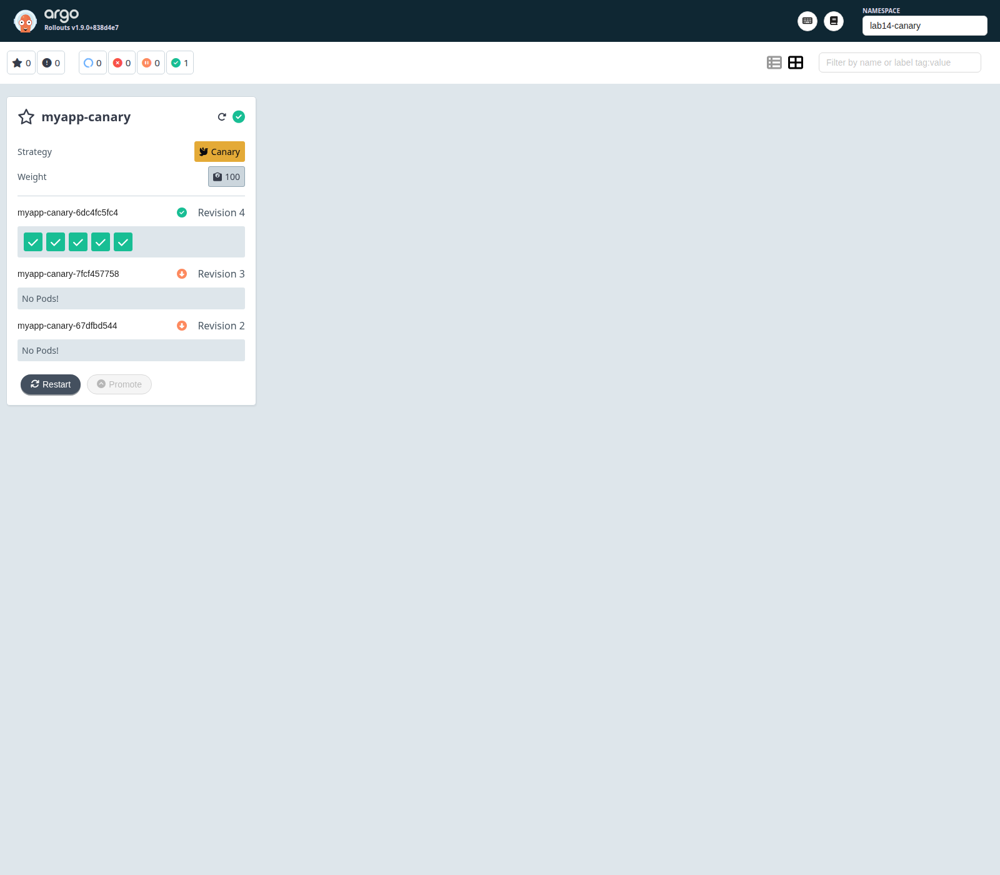
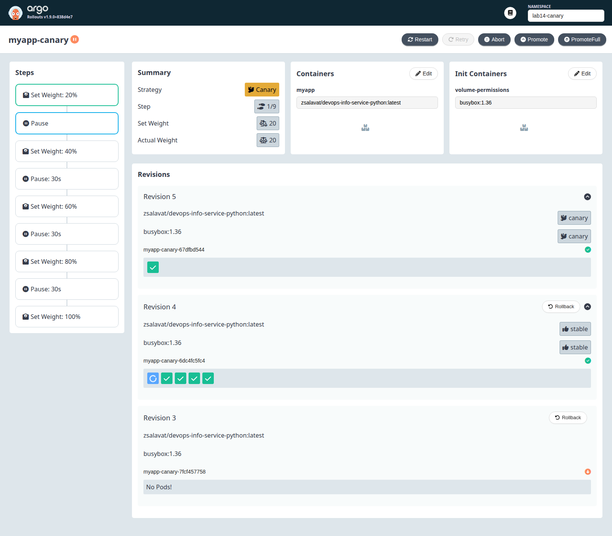
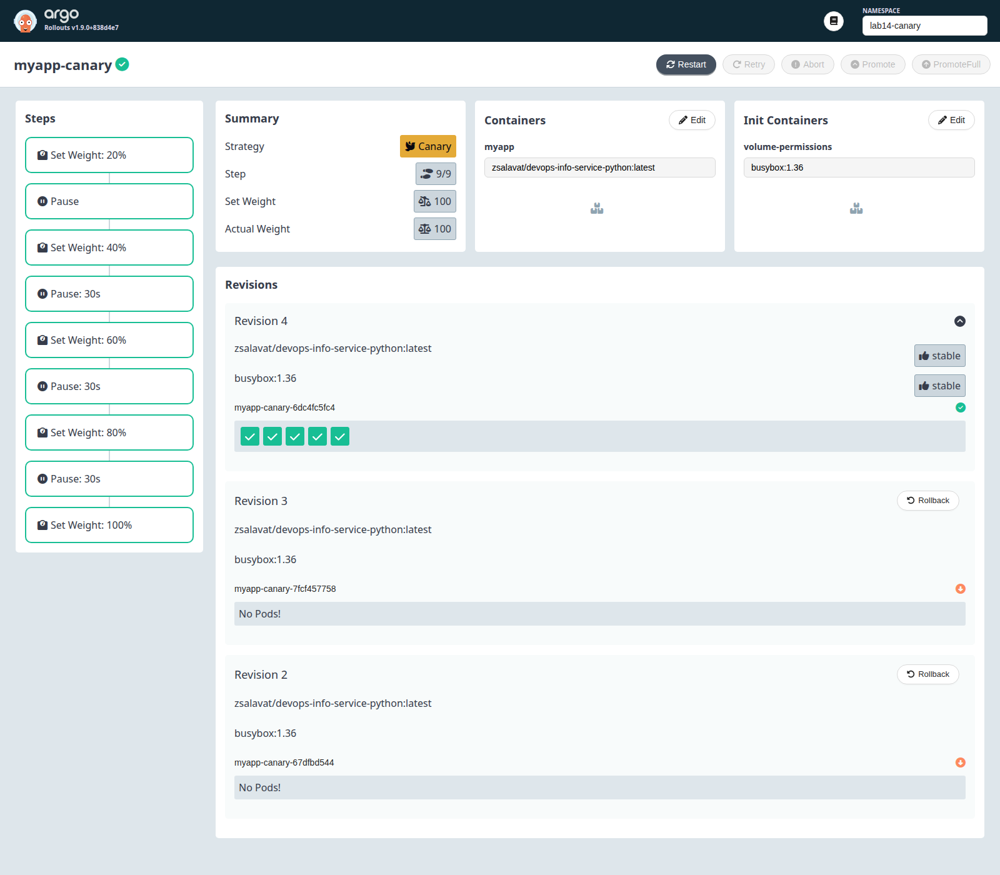
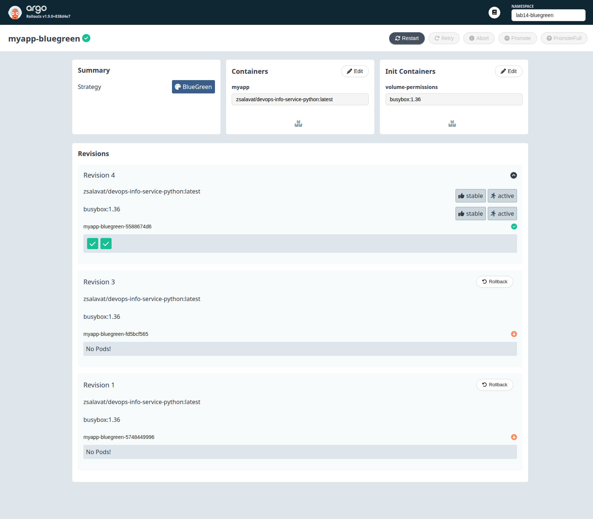

# Lab 14 - Progressive Delivery with Argo Rollouts

This document captures the Argo Rollouts setup, the Helm chart changes added for Lab 14, and the verified canary and blue-green rollout flows.

## Repo Changes

The Lab 14 implementation is in these files:

- `k8s/myapp/templates/rollout.yaml` - Argo `Rollout` resource with canary and blue-green strategies
- `k8s/myapp/templates/preview-service.yaml` - blue-green preview service
- `k8s/myapp/templates/analysis-template.yaml` - optional web-based `AnalysisTemplate`
- `k8s/myapp/values-rollout-canary.yaml` - enables canary rollout mode
- `k8s/myapp/values-rollout-bluegreen.yaml` - enables blue-green rollout mode
- `k8s/myapp/values-rollout-analysis.yaml` - enables the optional analysis step
- `k8s/myapp/templates/deployment.yml` - kept as a fallback for earlier labs when `rollout.enabled=false`

The base chart still renders the original `Deployment` by default so Lab 13 resources do not break unexpectedly. Lab 14 behavior is enabled through the rollout values files above.

## Argo Rollouts Setup

### Installation verification

Controller and dashboard were installed into the `argo-rollouts` namespace and the CRDs were created successfully.

Verification commands:

```bash
kubectl create namespace argo-rollouts --dry-run=client -o yaml | kubectl apply -f -
kubectl apply -n argo-rollouts -f https://github.com/argoproj/argo-rollouts/releases/latest/download/install.yaml
kubectl apply -n argo-rollouts -f https://github.com/argoproj/argo-rollouts/releases/latest/download/dashboard-install.yaml
kubectl argo rollouts version
kubectl get pods -n argo-rollouts
kubectl get crd rollouts.argoproj.io analysistemplates.argoproj.io
```

Observed state:

```text
$ kubectl argo rollouts version
kubectl-argo-rollouts: v1.9.0+838d4e7

$ kubectl get pods -n argo-rollouts
argo-rollouts-5f64f8d68-fqwz4             1/1 Running
argo-rollouts-dashboard-755bbc64c-ck9wk   1/1 Running

$ kubectl get crd rollouts.argoproj.io analysistemplates.argoproj.io
rollouts.argoproj.io            2026-04-25T13:19:34Z
analysistemplates.argoproj.io   2026-04-25T13:19:34Z
```

### Dashboard access

Port-forward command:

```bash
kubectl port-forward svc/argo-rollouts-dashboard -n argo-rollouts 3100:3100
```

Open:

```text
http://127.0.0.1:3100/rollouts/
```

Dashboard service verification:

```text
$ kubectl get svc argo-rollouts-dashboard -n argo-rollouts
NAME                      TYPE        CLUSTER-IP       PORT(S)
argo-rollouts-dashboard   ClusterIP   10.111.169.239   3100/TCP
```

Dashboard screenshot:



### Rollout vs Deployment

`Rollout` keeps most of the `Deployment` structure, but adds progressive delivery controls:

| Resource | Key behavior |
|---|---|
| `Deployment` | Rolling update only, no staged traffic progression |
| `Rollout` | `canary` or `blueGreen` strategy, pause steps, promotion, abort, undo, analysis |

For this chart, the pod template, probes, volumes, secrets, config maps, and service account stayed the same. The main change was replacing the update strategy with Argo Rollouts strategy blocks.

## Canary Deployment

### Strategy configuration

Canary is enabled with `k8s/myapp/values-rollout-canary.yaml`:

```yaml
replicaCount: 5

service:
  type: ClusterIP

rollout:
  enabled: true
  strategy: canary
```

Important details:

- `replicaCount: 5` makes the `20/40/60/80/100` steps map cleanly to pod counts.
- `service.type: ClusterIP` avoids conflicts with earlier fixed NodePorts from previous labs.
- The canary steps are defined in `k8s/myapp/templates/rollout.yaml` as:
  - `20% -> pause {}`
  - `40% -> pause 30s`
  - `60% -> pause 30s`
  - `80% -> pause 30s`
  - `100%`

Deploy command:

```bash
kubectl create namespace lab14-canary --dry-run=client -o yaml | kubectl apply -f -
helm upgrade --install myapp-canary ./k8s/myapp -n lab14-canary \
  -f ./k8s/myapp/values.yaml \
  -f ./k8s/myapp/values-rollout-canary.yaml
```

Initial rollout state:

```text
$ kubectl argo rollouts get rollout myapp-canary -n lab14-canary
Status: Healthy
Strategy: Canary
Step: 9/9
SetWeight: 100
Desired: 5
Ready: 5
```

### Step-by-step rollout progression

I triggered a new rollout by changing the config value used in the chart checksum:

```bash
helm upgrade myapp-canary ./k8s/myapp -n lab14-canary \
  -f ./k8s/myapp/values.yaml \
  -f ./k8s/myapp/values-rollout-canary.yaml \
  --set config.logLevel=DEBUG
```

Observed progression:

| Stage | Command / event | Observed result |
|---|---|---|
| Update started | `helm upgrade ... --set config.logLevel=DEBUG` | New ReplicaSet created and rollout moved to `Progressing` |
| First gate | automatic | `Paused`, `Step 1/9`, `SetWeight 20`, `ActualWeight 20`, `Updated 1/5` |
| Manual promotion | `kubectl argo rollouts promote myapp-canary -n lab14-canary` | Rollout resumed and moved to `Step 2/9` with `SetWeight 40` |
| Timed progression | automatic | After the first promotion, timed pauses advanced the rollout through `40/60/80` |
| Completion | automatic | `Healthy`, `Step 9/9`, `ActualWeight 100`, new ReplicaSet became stable |

Paused state at 20%:

```text
$ kubectl argo rollouts get rollout myapp-canary -n lab14-canary
Status: Paused
Message: CanaryPauseStep
Step: 1/9
SetWeight: 20
ActualWeight: 20
Desired: 5
Updated: 1
Ready: 5
```

Dashboard screenshot of the paused canary step:



State immediately after manual promotion:

```text
$ kubectl argo rollouts promote myapp-canary -n lab14-canary
$ kubectl argo rollouts get rollout myapp-canary -n lab14-canary
Status: Progressing
Step: 2/9
SetWeight: 40
Updated: 2
```

Completed state:

```text
$ kubectl argo rollouts get rollout myapp-canary -n lab14-canary
Status: Healthy
Step: 9/9
SetWeight: 100
ActualWeight: 100
Updated: 5
Ready: 5
```

Dashboard screenshot of the rollout detail view:



### Promotion and abort demonstration

To verify rollback, I started another canary update and aborted it at the first manual pause:

```bash
helm upgrade myapp-canary ./k8s/myapp -n lab14-canary \
  -f ./k8s/myapp/values.yaml \
  -f ./k8s/myapp/values-rollout-canary.yaml \
  --set config.logLevel=WARNING

kubectl argo rollouts abort myapp-canary -n lab14-canary
```

Observed result:

| Moment | Observed result |
|---|---|
| Right after abort | `Status: Degraded`, `Message: RolloutAborted`, canary still had `ActualWeight 20` while it was being scaled down |
| 15 seconds later | `ActualWeight 0`, `UpdatedReplicas 0`, stable ReplicaSet served traffic again |

Aborted state:

```text
$ kubectl argo rollouts get rollout myapp-canary -n lab14-canary
Status: Degraded
Message: RolloutAborted: Rollout aborted update to revision 3
Step: 0/9
SetWeight: 0
ActualWeight: 20
```

Rollback completed:

```text
$ kubectl argo rollouts get rollout myapp-canary -n lab14-canary
Status: Degraded
Message: RolloutAborted: Rollout aborted update to revision 3
SetWeight: 0
ActualWeight: 0
UpdatedReplicas: 0
Ready: 5
Available: 5
```

Even though the rollout remains marked `Degraded` after an abort, traffic was shifted back to the stable ReplicaSet correctly.

## Blue-Green Deployment

### Strategy configuration

Blue-green is enabled with `k8s/myapp/values-rollout-bluegreen.yaml`:

```yaml
replicaCount: 2

service:
  type: ClusterIP

rollout:
  enabled: true
  strategy: blueGreen
  blueGreen:
    autoPromotionEnabled: false
    scaleDownDelaySeconds: 30
    previewServiceType: ClusterIP
```

The blue-green block in `k8s/myapp/templates/rollout.yaml` uses:

- `activeService: <release>-service`
- `previewService: <release>-preview`
- `autoPromotionEnabled: false`
- `scaleDownDelaySeconds: 30`

The preview service is defined in `k8s/myapp/templates/preview-service.yaml`.

Deploy command:

```bash
kubectl create namespace lab14-bluegreen --dry-run=client -o yaml | kubectl apply -f -
helm upgrade --install myapp-bluegreen ./k8s/myapp -n lab14-bluegreen \
  -f ./k8s/myapp/values.yaml \
  -f ./k8s/myapp/values-rollout-bluegreen.yaml
```

Initial rollout state:

```text
$ kubectl argo rollouts get rollout myapp-bluegreen -n lab14-bluegreen
Status: Healthy
Strategy: BlueGreen
Desired: 2
Ready: 2
```

### Preview vs active service

I triggered a new preview revision with:

```bash
helm upgrade myapp-bluegreen ./k8s/myapp -n lab14-bluegreen \
  -f ./k8s/myapp/values.yaml \
  -f ./k8s/myapp/values-rollout-bluegreen.yaml \
  --set config.environment=bluegreen-preview \
  --set config.logLevel=DEBUG
```

The rollout paused automatically for manual promotion:

```text
$ kubectl argo rollouts get rollout myapp-bluegreen -n lab14-bluegreen
Status: Paused
Message: BlueGreenPause
Images: latest (active, preview, stable)
Current: 4
Updated: 2
```

Before promotion, the services pointed to different ReplicaSets:

```text
$ kubectl get svc myapp-bluegreen-service -n lab14-bluegreen -o jsonpath='{.spec.selector}'
{"rollouts-pod-template-hash":"5748449996",...}

$ kubectl get svc myapp-bluegreen-preview -n lab14-bluegreen -o jsonpath='{.spec.selector}'
{"rollouts-pod-template-hash":"5588674d6",...}
```

I port-forwarded both services to compare them directly:

```bash
kubectl port-forward svc/myapp-bluegreen-service -n lab14-bluegreen 8080:80
kubectl port-forward svc/myapp-bluegreen-preview -n lab14-bluegreen 8081:80
```

Observed responses before promotion:

```text
$ curl -s http://127.0.0.1:8080/ | jq '{hostname: .system.hostname, uptime_seconds: .runtime.uptime_seconds}'
{
  "hostname": "myapp-bluegreen-5748449996-qmg5d",
  "uptime_seconds": 78
}

$ curl -s http://127.0.0.1:8081/ | jq '{hostname: .system.hostname, uptime_seconds: .runtime.uptime_seconds}'
{
  "hostname": "myapp-bluegreen-5588674d6-b7zqb",
  "uptime_seconds": 38
}
```

That confirmed the active service still served the old pods, while the preview service already pointed to the new revision.

Dashboard screenshot of the blue-green rollout detail view:



### Promotion process

Promotion command:

```bash
kubectl argo rollouts promote myapp-bluegreen -n lab14-bluegreen
```

Observed result:

- The rollout switched to `Healthy` immediately after promotion.
- The active service selector changed to the new `rollouts-pod-template-hash`.
- The old ReplicaSet stayed alive only during `scaleDownDelaySeconds: 30`.

Selector after promotion:

```text
$ kubectl get svc myapp-bluegreen-service -n lab14-bluegreen -o jsonpath='{.spec.selector}'
{"rollouts-pod-template-hash":"5588674d6",...}
```

Important verification note: when using `kubectl port-forward svc/...`, restart the port-forward after promotion because `kubectl` picks an endpoint when the tunnel starts.

After restarting the port-forward, the active service served the promoted revision:

```text
$ curl -s http://127.0.0.1:8082/ | jq '{hostname: .system.hostname, uptime_seconds: .runtime.uptime_seconds}'
{
  "hostname": "myapp-bluegreen-5588674d6-b7zqb",
  "uptime_seconds": 73
}
```

### Instant rollback

To verify fast rollback, I created one more blue-green revision, promoted it, and then immediately rolled back to the previous revision:

```bash
helm upgrade myapp-bluegreen ./k8s/myapp -n lab14-bluegreen \
  -f ./k8s/myapp/values.yaml \
  -f ./k8s/myapp/values-rollout-bluegreen.yaml \
  --set config.environment=bluegreen-rollback-test \
  --set config.logLevel=WARNING

kubectl argo rollouts promote myapp-bluegreen -n lab14-bluegreen
kubectl argo rollouts undo myapp-bluegreen -n lab14-bluegreen
```

Observed result:

| Step | Active service selector |
|---|---|
| After promotion to revision 3 | `fd5bcf565` |
| After `undo` back to previous revision | `5588674d6` |

Rollback verification:

```text
$ kubectl get svc myapp-bluegreen-service -n lab14-bluegreen -o jsonpath='{.spec.selector}'
{"rollouts-pod-template-hash":"5588674d6",...}

$ curl -s http://127.0.0.1:8084/ | jq '{hostname: .system.hostname, uptime_seconds: .runtime.uptime_seconds}'
{
  "hostname": "myapp-bluegreen-5588674d6-b7zqb",
  "uptime_seconds": 153
}
```

Compared with canary, the blue-green rollback was effectively instant because it only switched service selectors back to the already-running previous ReplicaSet.

## Strategy Comparison

| Topic | Canary | Blue-Green |
|---|---|---|
| Release style | Gradual traffic shift | Instant traffic switch |
| Risk reduction | Excellent for incremental exposure | Good, but still all-or-nothing at promotion time |
| Rollback speed | Fast, but not instant when traffic is already split | Near-instant while previous ReplicaSet is still available |
| Resource usage | Lower | Higher during preview because both versions run fully |
| Manual validation | First pause can act as a gate | Preview service is ideal for QA before cutover |
| Best fit | User-facing apps, unknown-risk changes | Environments that need strict preview validation and rapid rollback |

### Pros and cons

Canary pros:

- Gradual exposure limits blast radius
- Good fit for risky app changes
- Easy to add automated analysis later

Canary cons:

- Takes longer to finish
- Rollback is not as immediate as blue-green
- Weight accuracy without a traffic manager depends on replica count

Blue-green pros:

- Clear active vs preview separation
- Very simple mental model for QA and release approvals
- Very fast rollback while the old ReplicaSet is still running

Blue-green cons:

- Needs more capacity during rollout
- Promotion is still a full cutover event
- Preview verification usually requires extra access steps or port-forwarding

### Recommendation

- Use canary for production-facing services where you want to reduce risk gradually and possibly add automated health checks.
- Use blue-green when you need a clear preview environment and the fastest possible rollback.
- For this chart, I would choose canary for regular application updates and blue-green for releases that require explicit QA validation before production traffic moves.

## CLI Commands Reference

### Installation and verification

```bash
kubectl create namespace argo-rollouts --dry-run=client -o yaml | kubectl apply -f -
kubectl apply -n argo-rollouts -f https://github.com/argoproj/argo-rollouts/releases/latest/download/install.yaml
kubectl apply -n argo-rollouts -f https://github.com/argoproj/argo-rollouts/releases/latest/download/dashboard-install.yaml
kubectl argo rollouts version
kubectl get pods -n argo-rollouts
kubectl get crd rollouts.argoproj.io analysistemplates.argoproj.io
```

### Dashboard

```bash
kubectl port-forward svc/argo-rollouts-dashboard -n argo-rollouts 3100:3100
```

### Canary

```bash
helm upgrade --install myapp-canary ./k8s/myapp -n lab14-canary \
  -f ./k8s/myapp/values.yaml \
  -f ./k8s/myapp/values-rollout-canary.yaml

kubectl argo rollouts get rollout myapp-canary -n lab14-canary
kubectl argo rollouts promote myapp-canary -n lab14-canary
kubectl argo rollouts abort myapp-canary -n lab14-canary
kubectl argo rollouts retry rollout myapp-canary -n lab14-canary
```

### Blue-green

```bash
helm upgrade --install myapp-bluegreen ./k8s/myapp -n lab14-bluegreen \
  -f ./k8s/myapp/values.yaml \
  -f ./k8s/myapp/values-rollout-bluegreen.yaml

kubectl argo rollouts get rollout myapp-bluegreen -n lab14-bluegreen
kubectl argo rollouts promote myapp-bluegreen -n lab14-bluegreen
kubectl argo rollouts undo myapp-bluegreen -n lab14-bluegreen
```

### Monitoring and troubleshooting

```bash
kubectl get rollout -A
kubectl describe rollout myapp-canary -n lab14-canary
kubectl describe rollout myapp-bluegreen -n lab14-bluegreen
kubectl get rs -n lab14-canary
kubectl get svc -n lab14-bluegreen
kubectl get endpoints myapp-bluegreen-service -n lab14-bluegreen
kubectl logs -n argo-rollouts deploy/argo-rollouts
```

## Optional Bonus - Automated Analysis

The chart also includes an optional `AnalysisTemplate` for the bonus task.

- File: `k8s/myapp/templates/analysis-template.yaml`
- Enable with: `k8s/myapp/values-rollout-analysis.yaml`
- Provider: `web`
- Target: `http://<service>.<namespace>.svc.cluster.local/health`
- Success condition: `result == 'healthy'`

Enable it for canary with:

```bash
helm upgrade --install myapp-canary ./k8s/myapp -n lab14-canary \
  -f ./k8s/myapp/values.yaml \
  -f ./k8s/myapp/values-rollout-canary.yaml \
  -f ./k8s/myapp/values-rollout-analysis.yaml
```