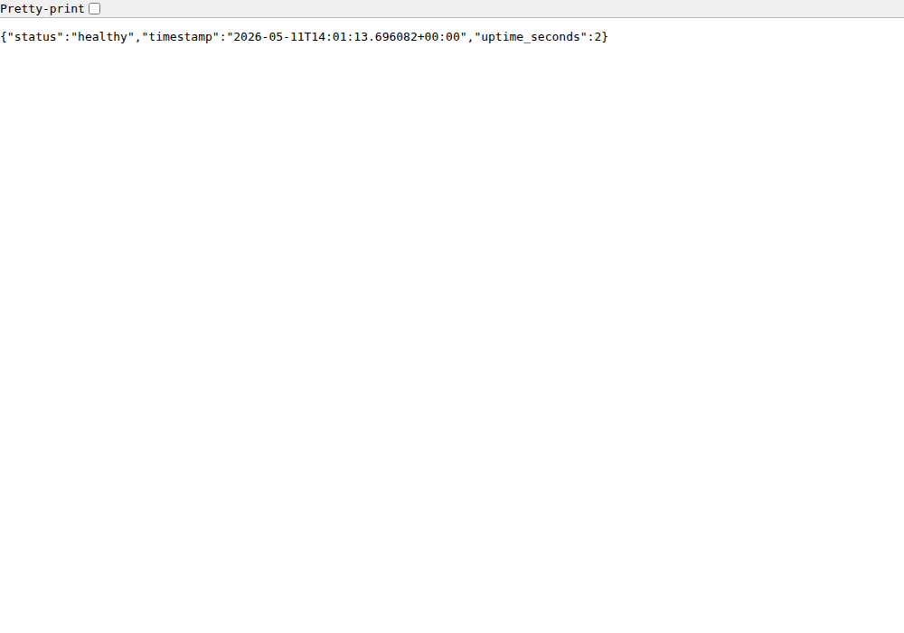

# Lab 18 Submission - Reproducible Builds with Nix

This document records the Lab 18 implementation for reproducible Python application builds, reproducible Docker images, and the bonus Nix Flake workflow.

## Repository Artifacts

| Path | Purpose |
|---|---|
| `labs/lab18/app_python/app.py` | Lab 1 DevOps Info Service copied for Lab 18 |
| `labs/lab18/app_python/requirements.txt` | Original pip dependency file for comparison |
| `labs/lab18/app_python/Dockerfile` | Traditional Lab 2 Dockerfile for comparison |
| `labs/lab18/app_python/default.nix` | Nix derivation for the Python service |
| `labs/lab18/app_python/docker.nix` | Reproducible Docker image definition using `dockerTools` |
| `labs/lab18/app_python/flake.nix` | Modern flake entry point and development shell |
| `labs/lab18/app_python/flake.lock` | Locked `nixpkgs` input for reproducibility over time |
| `labs/lab18/app_python/README.md` | Quick usage documentation |
| `labs/lab18/docs/screenshots/nix-health.png` | Browser screenshot of the Nix-built app health endpoint |
| `labs/lab18/docs/screenshots/lab2-health.png` | Browser screenshot of the traditional Docker app health endpoint |

## Environment

| Item | Value |
|---|---|
| OS | Ubuntu 26.04 LTS |
| Architecture | `x86_64-linux` |
| Docker | `Docker version 29.3.1, build c2be9cc` |
| Verification Nix runtime | Official `nixos/nix:latest` container |
| Nix version used for verification | `nix (Nix) 2.34.7` |

Host-level Nix was not installed in this automated workspace because the official installer requires sudo/admin access, creates `/nix`, and modifies shell configuration. Verification was performed with the official `nixos/nix` container, which gives the same Nix evaluator and builder without changing the host system.

Host check before containerized verification:

```text
zsh:1: command not found: nix
```

Containerized verification command:

```bash
docker run --rm nixos/nix:latest nix --version
```

Output:

```text
nix (Nix) 2.34.7
```

For a normal local submission machine, install Nix with:

```bash
curl --proto '=https' --tlsv1.2 -sSf -L https://install.determinate.systems/nix | sh -s -- install
nix --version
nix run nixpkgs#hello
```

## Task 1 - Reproducible Python App

### Application

The Lab 1 Flask service is available in `labs/lab18/app_python/app.py`. It exposes:

| Endpoint | Purpose |
|---|---|
| `/` | Service, runtime, request, system, and counter information |
| `/health` | Health check |
| `/visits` | Persistent visit counter |
| `/metrics` | Prometheus metrics |

The original pip workflow is represented by `requirements.txt`:

```text
flask==3.1.3
prometheus-client==0.23.1
pytest==8.2.2
pytest-cov==5.0.0
ruff==0.6.9
python-json-logger==3.2.1
```

### Nix Derivation

The derivation is in `labs/lab18/app_python/default.nix`.

Key fields:

| Field | Meaning |
|---|---|
| `python = pkgs.python313` | Uses Python 3.13 from the selected `nixpkgs` input |
| `pythonDeps` | Declares runtime Python dependencies: Flask, prometheus-client, and python-json-logger |
| `src = cleanSourceWith ...` | Copies only required source files into the Nix build input |
| `buildPythonApplication` | Builds the app in a Python-aware Nix derivation |
| `format = "other"` | Supports a simple app without `setup.py` or `pyproject.toml` |
| `propagatedBuildInputs` | Makes Python dependencies available at runtime |
| `makeWrapper` | Creates the `devops-info-service` executable |
| `VISITS_FILE=/tmp/devops-info-service/visits` | Avoids writes into the immutable `/nix/store` |
| `APP_CONFIG_PATH=/tmp/devops-info-service/config.json` | Uses a writable default config path |

The wrapper command installed by Nix is:

```text
devops-info-service
```

It runs the Flask app with pinned Python dependencies from Nix.

### Build Evidence

Command used inside the official Nix container:

```bash
cd labs/lab18/app_python
nix-build --no-out-link
```

Repeated build outputs:

```text
app_store_path_1=/nix/store/4z6jxkvmdmirxblkldkfwsf84yyfsh87-devops-info-service-1.0.0
app_store_path_2=/nix/store/4z6jxkvmdmirxblkldkfwsf84yyfsh87-devops-info-service-1.0.0
app_output_hash=46aa9913d7f0a8c00d76b9108e562759a293a23e819946b7592689eb04d3c54d
```

The store path is identical across repeated builds with the same inputs. This proves that Nix reused or reproduced the exact same output path.

### Runtime Evidence

Nix-built service startup was verified:

```text
* Serving Flask app 'app'
* Running on http://127.0.0.1:5000
```

Nix-built Docker image health response:

```json
{"status":"healthy","timestamp":"2026-05-11T13:58:47.309384+00:00","uptime_seconds":1}
```

Screenshot:



### Nix Store Path Format

Observed path:

```text
/nix/store/4z6jxkvmdmirxblkldkfwsf84yyfsh87-devops-info-service-1.0.0
```

| Part | Meaning |
|---|---|
| `/nix/store` | Immutable Nix store root |
| `4z6jxkvmdmirxblkldkfwsf84yyfsh87` | Hash derived from all build inputs |
| `devops-info-service` | Package name from `pname` |
| `1.0.0` | Package version from `version` |

If source, dependencies, build instructions, compiler, or environment inputs change, the hash changes and Nix creates a new store path.

### Pip versus Nix

| Aspect | Lab 1 pip and venv | Lab 18 Nix derivation |
|---|---|---|
| Python version | Comes from the host or base image | Comes from `nixpkgs` |
| Direct dependencies | Listed in `requirements.txt` | Declared in `pythonDeps` |
| Transitive dependencies | Resolved by pip at install time | Pinned by the selected `nixpkgs` input |
| Build isolation | Virtual environment only | Nix sandbox and immutable store |
| Output identity | No stable output hash | Stable `/nix/store/<hash>-name-version` path |
| Binary cache | No content-addressed cache | Nix can reuse exact binary cache artifacts |
| Rebuild result | Environment can drift over time | Same inputs produce same output path |

`requirements.txt` is weaker because it only describes Python packages for pip to resolve. Even with direct pins, the full environment also depends on the host Python, pip version, platform, wheels available at install time, and transitive dependency resolution. Nix models the whole dependency closure as build inputs.

Reflection: using Nix from Lab 1 would have removed the need to ask every machine to have the same Python and pip behavior. Everyone would build and run the same service closure from the same expression.

## Task 2 - Reproducible Docker Images

### Traditional Dockerfile

The Lab 2 Dockerfile is available at both:

```text
app_python/Dockerfile
labs/lab18/app_python/Dockerfile
```

It uses:

```dockerfile
FROM python:3.13-slim
RUN apt-get update && apt-get install -y --no-install-recommends curl \
    && rm -rf /var/lib/apt/lists/*
RUN pip install --no-cache-dir -r requirements.txt
CMD ["python", "app.py"]
```

This is good Docker practice, but it is not bit-for-bit reproducible because the build depends on mutable base image tags, apt repository state, pip install behavior, and image metadata.

### Nix dockerTools Image

The Nix image definition is in `labs/lab18/app_python/docker.nix`.

Key fields:

| Field | Meaning |
|---|---|
| `app = import ./default.nix` | Reuses the reproducible app derivation |
| `buildLayeredImage` | Builds an OCI/Docker image from Nix store paths |
| `name = "devops-info-service-nix"` | Image repository name |
| `tag = "1.0.0"` | Image tag |
| `contents = [ app ]` | Includes the app and runtime closure |
| `Cmd` | Starts the Nix-built executable |
| `ExposedPorts."5000/tcp"` | Documents Flask service port |
| `created = "1970-01-01T00:00:01Z"` | Fixed timestamp for reproducible image metadata |
| `extraCommands` | Creates writable `/tmp` in the image |

Nix image metadata:

```text
Created: 1970-01-01T00:00:01Z
Cmd: [/nix/store/4z6jxkvmdmirxblkldkfwsf84yyfsh87-devops-info-service-1.0.0/bin/devops-info-service]
Env: [HOST=0.0.0.0 PORT=5000 DEBUG=False APP_NAME=devops-info-service APP_ENV=nix-docker LOG_LEVEL=INFO VISITS_FILE=/tmp/devops-info-service/visits APP_CONFIG_PATH=/tmp/devops-info-service/config.json]
```

### Nix Image Reproducibility Evidence

Command:

```bash
cd labs/lab18/app_python
nix-build docker.nix --no-out-link
sha256sum /nix/store/ja8p4757xr21d2b1pf388ihrw3avfz1d-devops-info-service-nix.tar.gz
```

Repeated build outputs:

```text
docker_store_path_1=/nix/store/ja8p4757xr21d2b1pf388ihrw3avfz1d-devops-info-service-nix.tar.gz
docker_sha256_1=17c781226a7ad713ebb1468743d8e6c50cd2e79e2fe9eda1827ec67f5f3114e1
docker_store_path_2=/nix/store/ja8p4757xr21d2b1pf388ihrw3avfz1d-devops-info-service-nix.tar.gz
docker_sha256_2=17c781226a7ad713ebb1468743d8e6c50cd2e79e2fe9eda1827ec67f5f3114e1
```

The Nix-built image tarball is bit-for-bit identical across repeated builds.

### Traditional Docker Rebuild Evidence

Commands:

```bash
docker build -t lab2-app:lab18-test1 ./app_python
docker save lab2-app:lab18-test1 | sha256sum
docker build -t lab2-app:lab18-test2 ./app_python
docker save lab2-app:lab18-test2 | sha256sum
```

Observed outputs:

```text
created1=2026-05-11T14:36:59.542022354+03:00
created2=2026-05-11T14:36:59.542022354+03:00
hash1=d93913d73fa0a03e75635639c1caf1dbf8bd7ff013058de8e166635f6f0b890e
hash2=d9bc4f6f60cb5d3ad4d268cf41ad2f0ec85d310cb77557982f05533c01739f85
```

The two saved Docker images have different SHA256 hashes even though the same Dockerfile and source were used. In this run Docker cache kept the `Created` timestamp equal, but the exported image still changed, which is enough to show it is not bit-for-bit reproducible.

### Side-by-Side Runtime Evidence

Both images were run at the same time on random host ports.

```text
lab18-lab2-shot-1778508070 lab2-app:lab18-test1 127.0.0.1:32775->5000/tcp
lab18-nix-shot-1778508070 devops-info-service-nix:1.0.0 127.0.0.1:32774->5000/tcp
```

Traditional Docker health response:

```json
{"status":"healthy","timestamp":"2026-05-11T14:01:13.249682+00:00","uptime_seconds":1}
```

Nix Docker health response:

```json
{"status":"healthy","timestamp":"2026-05-11T14:01:13.241506+00:00","uptime_seconds":2}
```

Screenshots:


### Image Size Comparison

| Image | Size | Image ID |
|---|---:|---|
| `lab2-app:lab18-test1` | 263MB | `48a74f72f77b` |
| `lab2-app:lab18-test2` | 263MB | `ecf1887901f5` |
| `devops-info-service-nix:1.0.0` | 389MB | `e4921b42be39` |

The Nix image is larger for this Python service because it carries the complete Nix Python runtime closure as immutable store paths. The benefit here is not image size; it is exact dependency identity, fixed metadata, and reproducible output. A smaller Nix image would require additional closure minimization or a different runtime strategy.

### Layer Analysis

Nix image history excerpt:

```text
IMAGE            CREATED   SIZE     COMMENT
e4921b42be39     N/A       36.9kB   store paths: devops-info-service-nix-customisation-layer
<missing>        N/A       53.2kB   store paths: devops-info-service-1.0.0
<missing>        N/A       1.35MB   store paths: python3.13-flask-3.1.2
<missing>        N/A       934kB    store paths: python3.13-prometheus-client-0.22.1
<missing>        N/A       262kB    store paths: python3.13-python-json-logger-3.3.0
<missing>        N/A       119MB    store paths: python3-3.13.11
```

Traditional Docker history excerpt:

```text
IMAGE            CREATED       CREATED BY                                            SIZE
48a74f72f77b     2 hours ago   CMD ["python" "app.py"]                              0B
<missing>        2 hours ago   EXPOSE [5000/tcp]                                    0B
<missing>        2 hours ago   USER app                                             0B
<missing>        2 hours ago   RUN chown -R app:app /app                            0B
<missing>        2 hours ago   COPY app.py /app/                                    20.5kB
<missing>        4 weeks ago   RUN pip install --no-cache-dir -r requirements.txt   43.2MB
<missing>        4 weeks ago   RUN apt-get update && apt-get install curl           13.5MB
```

Nix layers are based on immutable store paths. Traditional Docker layers are based on build instructions and mutable external sources such as base image tags, apt repositories, and pip package indexes.

### Dockerfile versus Nix dockerTools

| Aspect | Lab 2 Dockerfile | Lab 18 Nix dockerTools |
|---|---|---|
| Base image | `python:3.13-slim` tag | No base image required |
| Python runtime | Comes from Docker base image | Comes from Nix store closure |
| Dependencies | Installed by pip during build | Declared in Nix derivation |
| Metadata timestamp | Docker/BuildKit generated | Fixed to `1970-01-01T00:00:01Z` |
| Rebuild hash | Different saved image hashes | Identical tarball hash |
| Layer model | Dockerfile instruction layers | Content-addressed Nix store layers |
| Rollback confidence | Depends on tag and registry state | Store path identifies exact content |

Traditional Dockerfiles cannot guarantee bit-for-bit reproducibility because they allow mutable inputs. A tag like `python:3.13-slim` can point to different content later, `apt-get update` reads a moving package index, and `pip install` depends on the package index and wheel availability at build time.

Practical scenarios where Nix reproducibility matters:

| Scenario | Why Nix helps |
|---|---|
| CI/CD | CI and developer machines build the same closure |
| Security audits | Exact dependency graph can be inspected by store path |
| Rollbacks | Known-good store path or image tarball can be reused |
| Incident response | Rebuilds do not silently pick up newer dependencies |
| Binary cache | Identical inputs can reuse cached artifacts safely |

Reflection: if I could redo Lab 2 with Nix, I would still use Docker for runtime compatibility, but I would build the image from `dockerTools` and publish a digest-backed image instead of relying on mutable Dockerfile inputs.

## Bonus Task - Modern Nix with Flakes

### Flake Files

The flake files are:

```text
labs/lab18/app_python/flake.nix
labs/lab18/app_python/flake.lock
```

The flake exposes:

| Output | Purpose |
|---|---|
| `packages.x86_64-linux.default` | App derivation from `default.nix` |
| `packages.x86_64-linux.dockerImage` | Docker image derivation from `docker.nix` |
| `apps.x86_64-linux.default` | Runnable app entry point |
| `devShells.x86_64-linux.default` | Development shell with Python, Flask, pytest, coverage, and ruff |

### Lock File Evidence

`flake.lock` pins `nixpkgs` exactly:

```json
{
  "locked": {
    "lastModified": 1778003029,
    "narHash": "sha256-q/nkKLDtHIyLjZpKhWk3cSK5IYsFqtMd6UtXF3ddjgA=",
    "owner": "NixOS",
    "repo": "nixpkgs",
    "rev": "0c88e1f2bdb93d5999019e99cb0e61e1fe2af4c5",
    "type": "github"
  },
  "original": {
    "owner": "NixOS",
    "ref": "nixos-25.11",
    "repo": "nixpkgs",
    "type": "github"
  }
}
```

This lock fixes the package set used by the build. It pins Python, Flask, transitive Python libraries, compilers, libc, and all other packages from the selected `nixpkgs` revision.

### Flake Verification

Command:

```bash
cd labs/lab18/app_python
nix --extra-experimental-features "nix-command flakes" flake check --no-build
nix --extra-experimental-features "nix-command flakes" build --no-link
nix --extra-experimental-features "nix-command flakes" build .#dockerImage --no-link
nix --extra-experimental-features "nix-command flakes" develop --command python --version
```

Output excerpt:

```text
checking derivation packages.x86_64-linux.default...
checking derivation packages.x86_64-linux.dockerImage...
checking app 'apps.x86_64-linux.default'...
checking derivation devShells.x86_64-linux.default...
all checks passed!
Lab 18 dev shell: Python 3.13.12, Flask, prometheus-client, pytest, and ruff are available.
Python 3.13.12
```

### Nix Develop versus Lab 1 venv

| Aspect | Lab 1 `venv` | Lab 18 `nix develop` |
|---|---|---|
| Python source | Host Python | Locked `nixpkgs` Python |
| Dependency source | PyPI at install time | Locked Nix store paths |
| Setup command | `python -m venv && pip install -r requirements.txt` | `nix develop` |
| Transitive dependency drift | Possible | Prevented by `flake.lock` |
| Recreate on another machine | Best effort | Same flake inputs produce same environment |

`nix develop` would have prevented a common "works on my machine" problem: a teammate using a different host Python or newer transitive dependency would enter the same pinned shell instead.

### Comparison with Lab 10 Helm Values

Current Helm values in `k8s/myapp/values.yaml`:

```yaml
image:
  repository: zsalavat/devops-info-service-python
  tag: latest
  pullPolicy: IfNotPresent
```

Comparison:

| Aspect | Lab 10 Helm values | Lab 18 Nix Flakes |
|---|---|---|
| What is pinned | Image repository and tag value | Full `nixpkgs` revision and content hash |
| Mutable tag risk | `latest` can change | Locked revision cannot change silently |
| Python dependencies | Hidden inside image | Part of locked closure |
| Build tools | Not locked by Helm | Locked by `flake.lock` |
| Kubernetes deployment | Strong | Not a deployment tool |
| Build reproducibility | Depends on image digest discipline | Cryptographic input lock |

Best combined approach: build the image with Nix, publish it by digest, and reference that immutable digest from Helm values.

## Commands Summary

```bash
cd labs/lab18/app_python

# App build
nix-build
./result/bin/devops-info-service

# Docker image build
nix-build docker.nix
docker load < result
docker run -d -p 5001:5000 --name nix-container devops-info-service-nix:1.0.0
curl http://localhost:5001/health

# Flake build
nix flake lock
nix build
nix build .#dockerImage
nix develop
```

## Notes and Limitations

Host-level Nix installation should be run manually on the final submission machine because it requires privileged system changes. All expressions and images were validated with the official Nix container in this workspace.

The required PR/MR was not opened from this automated session because that requires committing, pushing, and using a remote account. The implementation and documentation are ready to commit on the lab branch.
